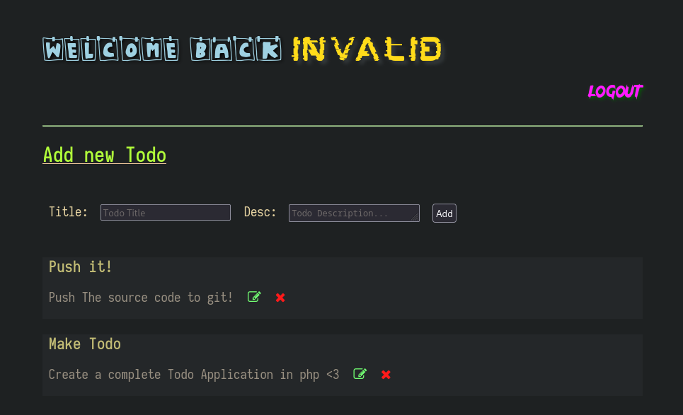

# ldo
ldo is a simple todo application being written in php (not completed yet).

### why php?
Cause I am learning it! I am getting php training sessions at my college.

### features
- login, sign-up feature
- multi-user support
- holds session for certain time
- use of mysql database
- edit/delete todos
- mark as done will be addded soon

### Requirements
- You should have installed and enabled php and mysql servers or just install xampp/lampp and start it.

### Configuration
- Database configuration is done in [config.php](https://www/github.com/whoisYoges/ldo/blob/master/assets/pages/config.php).
- Two tables `todos` and `users` should be created.
    - Columns in `users` table are `id (primary_key + auto_increament)`, `email`, `password`, `name`, and `image`.
    - Columns in `todos` are `id (primary_key + auto increament)`, `title`, `description`, and `user_id`.
    - `id` of `users` table and  `use_id` of `todos` table should be same and interconnected so, join them using foreign key. 

Practically,
1. Create a database (give any name) and then configure it accordingly in [config.php](https://www/github.com/whoisYoges/ldo/blob/master/assets/pages/config.php).

2. Create a table `users` in database.
```
CREATE TABLE `users` (
    `id` INT NOT NULL AUTO_INCREMENT,
    `name` VARCHAR(155) NOT NULL,
    `email` VARCHAR(255) NOT NULL,
    `password` VARCHAR(155) NOT NULL,
    `image` VARCHAR(255),
    PRIMARY KEY (`id`)
);
```
3. Create a table `todos` in same database.

```
CREATE TABLE `todos` (
    `id` INT NOT NULL AUTO_INCREMENT,
    `title` VARCHAR(255) NOT NULL,
    `description` TEXT NOT NULL,
    `user_id` INT NOT NULL,
    PRIMARY KEY (`id`),
    FOREIGN KEY(`user_id`) REFERENCES users(`id`)
);
```
The table should look like following:


### Keep in mind
- image name is generated randomly and image name is saved in image column of users table in database.
- real image is saved in [uploads](https://github.com/whoisYoges/ldo/tree/master/uploads/) directory.

### Project Overview Till Now (Way more to go)
[](.helper/preview.mp4)
